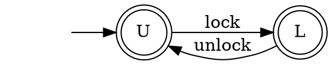
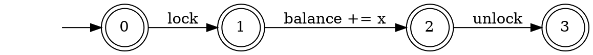
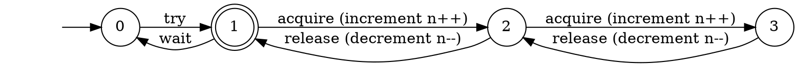
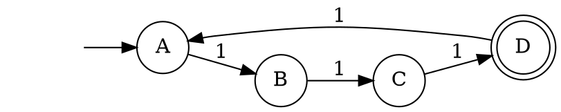

# Group 
- Vikram Jan
- Ahmad Mustafid
- Michael Youssef


# Excercise 1 (Solution)

## 1. Correctness of the Determinization Construction

Complete the proof of correctness of the determinization construction.

Let `N` be a NFA and `D` be a DFA obtained from `N` using the powerset construction.
Show that any word accepted by `D` is also accepted by `N`: `w ∈ L(D) ⇒ w ∈ L(N)`.

### Solution :

If $D = (Q_D, Σ, δ_D, \lbrace q_0 \rbrace, F_D)$ is the DFA constructed from NFA $N = (Q_N, Σ, δ_N, q_0, F_N)$ by the `subset construction / powerset construction` _( Method for converting a nondeterministic finite automaton (NFA) into a deterministic finite automaton (DFA))_. 

Then $w ∈ L(D) ⇒ w ∈ L(N)$

#### Proof :
- By Induction on $|w|$ is that, $\hat{\delta}_D(\lbrace q_0 \rbrace,w) = \hat{\delta}_N(q_0,w)$

  Notice that each of $\hat{\delta}$ functions returns a set of states from $Q_N$, but the $\hat{\delta}_D$ inteprets as one set of the states of $Q_D$ (which is the powerset of $Q_N$). While, $\hat{\delta}_N$ inteprets this as a subset of $Q_N$.

- Let $|w| = 0$; that is, $w= \epsilon$. 

  By the basis definition of $\hat{\delta}$ for DFA and NFA, both $\hat{\delta}_D(\lbrace q_0 \rbrace,w)$ and $\hat{\delta}_N(q_0,w)$ are $\lbrace q_0 \rbrace$

- Let $w$ be of length $n+1$, and assume that the statement for length $n$. Break $w$ up as $w=xa$, where $a$ is the final symbol of $w$. By using the inductive hypothesis, $\hat{\delta}_D(\lbrace q_0 \rbrace,x) = \hat{\delta}_N(q_0,x)$. Let both of these sets of N's states be $\lbrace p_1,p_2,p_3,...,p_k \rbrace$.

  - The inductive part of the definition of $\hat{\delta}_D$ for NFA's tell us: $\hat{\delta}_N(q_0, w) = \bigcup _{i=1}^k \delta_N(p_i, a)$  $...(1.1)$

  - The subset construction, on the other hand tells us that: $\hat{\delta}_D(\lbrace p_1,p_2,p_3,...,p_k \rbrace, a) = \bigcup _{i=1}^k \delta_N(p_i, a)$ $...(1.2)$

  - Now, let us use $(1.2)$ and the fact that $\hat{\delta}_D(\lbrace q_0 \rbrace,x) = \lbrace p_1,p_2,p_3,...,p_k \rbrace$ in the inductive part of the definition of $\hat{\delta}_D$ for for DFA's:

    $\hat{\delta}_D(\lbrace q_0 \rbrace,w) = \delta_D ( \hat{\delta}_D(\lbrace q_0 \rbrace,x),a) = \delta_D( \lbrace p_1,p_2,p_3,...,p_k \rbrace ,a) = \bigcup _{i=1}^k \delta_N(p_i, a)$ $...(1.3)$
  
- Thus, Equations $(1.1)$ and $(1.3)$ demonstrate that $\hat{\delta}_D(\lbrace q_0 \rbrace,w) = \hat{\delta}_N(q_0,w)$. 

- When we observe that D and N both accept $w$ if and only if $\hat{\delta}_D(\lbrace q_0 \rbrace,w)$ or $\hat{\delta}_N(q_0,w)$, respectively, contains a state in $F_N$, we have complete proof that $L(D) = L(N)$


## 2. Encoding Programs as Automaton

Recall the lock automaton:



And the increment program:
```c
int balance;

void increase(int x) {
    lock();
    balance += x;
    unlock();
}
```
and the corresponding automaton:


## Tasks 2.1
Generalize this example to use a `semaphore` instead of a lock.
A semaphore generalize a lock with counting.
The equivalent of `lock` is `acquire` and `release` instead of `unlock`.
However a semaphore allows up to `n` processes to `acquire` permits before a process releases one permit.
`n` is a parameter given during the creation of the semaphore.

Instantiate your example with 3 `increase` program and a semaphore with `n=2`.

You are allowed to change the automata (states, alphabet, transition, etc.).
If this is possible, suggest an alternate model where this is possible.

### Solution

A semaphore is based on an internal counter which is `increment` each time _acquire()_ is called and `decremented` each time _release()_ is called. The constructor takes a value which is the counter initial value. This value defaults to 1. A condition instance `0` (try and wait) is created with a lock to protect the counter.

The semaphore with `n=2`:





## Task 2.2
Generalize this example to make the lock _reentrant_.
A reentrant lock allows one thread to `lock` the same lock multiple times.
The lock must be `unlock`ed the same number of times it was `lock`ed before a new process can acquire it.

You are allowed to change the automata (states, alphabet, transition, etc.).
If this is possible, suggest an alternate model where this is possible.

### Solution (more)
To create a `lock reentrant`, we should use a push down automata.

Same as the diagraph above, we need to modify the alphabet to distinguish between processes (0 for lock and unlock; 123 for the process). The process has already had the lock can lock the process again. The states that can enter on the process will be stacked and if the stack is full the process will be locked. So, a new process that tries to enter the process will wait until the stack has release at least one process.


## 3. Longest (Worst Case) Shortest Counterexample to a Safety Property for Automata

Consider the setting where we have a program and a safety property encoded as automata.
For instance, this is the setting of the previous example.
Let us further assume that the automaton are DFAs.

* Assume the automaton for the program has `m` states, the property has `n` states, and the program does not respect the property.
  This means that the product of the program and the negated property is non-empty.
  In the worst case, how long is the shortest word in the product of the program and the negated property?
* Can you construct an example that reaches your bound?
* Prove your bound
* What happens when there are many copies of the program (e.g. concurrency)? _hint._ this is one of the reason testing concurrent programs is hard.

### Solution

In this case we use a DFA as the Automaton

- The longest / worst case, of the Shortest Counterexample to a Safety Property has $m$ states and $n$ properties. So the size of the DFA is $m * n - 1$.

- For an alphabet with a single letter $Σ = \{ a \}$. We can count modulo $n$ by using the DFA with $n$ states. For example, a DFA that accepts the word of size $w$ where $(|w| \mod 4) = 3$:



- Let products from two automatons build the same way $(|w| \mod m) = m-1$ and $(|w| \mod n) = n-1$. The size for first accepted word has $m * n - 1$.

- The examples provided above shows that the bound is at least have $m * n - 1$. We want to prove by:

  - The short words accepted by the automation will not visit a state twice.

  - In the graph the path of size $s$ visit $s+1$ nodes. By the two prove this, we have a word of size $m * n - 1$ visit at most $m * n$ different states. The word that longer than that will visit one state twice or more, therefore, it cannot be the shortest accepted word.

- Thus, the product of this is an exponential number of automaton.
  
  If we have programs run in parallel, it will explore exponentially longer executions to find bugs. This problem is known as `the state-space explosion problem` and test the Concurrent Programs (in the worst case) is hard to do.


## 4. The Need for Multiple Final States for DFAs

Assume a DFA can have at most one final state. 
Show that there is a regular language `L` over a unary alphabet ($\Sigma = \\{ a \\}$) which is not recognizable with this model,
i.e. there is no DFA with a single final state whose language `L`.
Prove your claim.

### Solution
