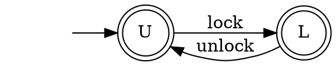
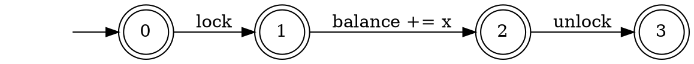

## 1. Correctness of the Determinization Construction

Complete the proof of correctness of the determinization construction.

Let `N` be a NFA and `D` be a DFA obtained from `N` using the powerset construction.
Show that any word accepted by `D` is also accepted by `N`: `w ∈ L(D) ⇒ w ∈ L(N)`.

## Solution


## 2. Encoding Programs as Automaton

Recall the lock automaton:



And the increment program:
```c
int balance;

void increase(int x) {
    lock();
    balance += x;
    unlock();
}
```
and the corresponding automaton:


__Tasks 1.__
Generalize this example to use a `semaphore` instead of a lock.
A semaphore generalize a lock with counting.
The equivalent of `lock` is `acquire` and `release` instead of `unlock`.
However a semaphore allows up to `n` processes to `acquire` permits before a process releases one permit.
`n` is a parameter given during the creation of the semaphore.

Instantiate your example with 3 `increase` program and a semaphore with `n=2`.

You are allowed to change the automata (states, alphabet, transition, etc.).
If this is possible, suggest an alternate model where this is possible.

## Solution


__Task 2.__
Generalize this example to make the lock _reentrant_.
A reentrant lock allows one thread to `lock` the same lock multiple times.
The lock must be `unlock`ed the same number of times it was `lock`ed before a new process can acquire it.

You are allowed to change the automata (states, alphabet, transition, etc.).
If this is possible, suggest an alternate model where this is possible.

## Solution


## 3. Longest (Worst Case) Shortest Counterexample to a Safety Property for Automata

Consider the setting where we have a program and a safety property encoded as automata.
For instance, this is the setting of the previous example.
Let us further assume that the automaton are DFAs.

* Assume the automaton for the program has `m` states, the property has `n` states, and the program does not respect the property.
  This means that the product of the program and the negated property is non-empty.
  In the worst case, how long is the shortest word in the product of the program and the negated property?
* Can you construct an example that reaches your bound?
* Prove your bound
* What happens when there are many copies of the program (e.g. concurrency)? _hint._ this is one of the reason testing concurrent programs is hard.

## Solution


## 4. The Need for Multiple Final States for DFAs

Assume a DFA can have at most one final state. 
Show that there is a regular language `L` over a unary alphabet ($\Sigma = \\{ a \\}$) which is not recognizable with this model,
i.e. there is no DFA with a single final state whose language `L`.
Prove your claim.

## Solution
